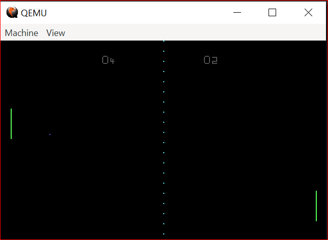
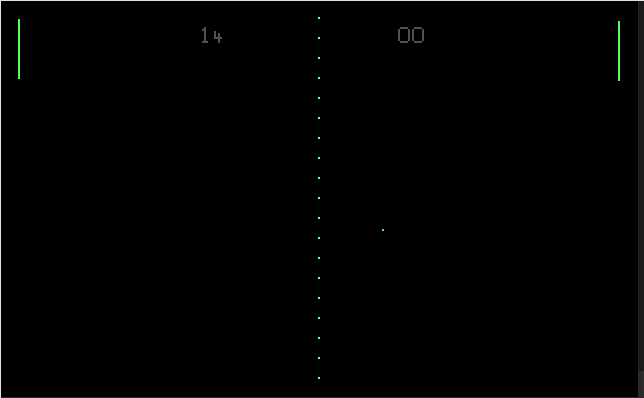

# Pong_Boot_Sector
This is a minimal implementation of the classic Pong game that runs without an operating system in 16-bit real mode. The game executes primarily from the boot sector (first 512 bytes of the disk), with supporting image data loaded from subsequent disk sectors into memory. It boots straight into the game on real hardware or in an emulator, showcasing low-level x86 programming and direct hardware control.

*Note that in the gif there are some compression artifacts that makes the paddles look wrong, this doesnt show up when running it in the emulator.*

### Assembling
Edit the run.cmd file to contain paths to your instilation of nasm and quemu then simply run it and all should work. If you are on Linux or Mac modifactions will need to be made the run.cmd file but these should be easy. There is a command that is commented out that calles a python script, this converts the png image for each character to a bitmap. The bitmaps are allready included in the repo so only uncomment this if you desire to make changes to the font.

### Running
Controlls for the player on the left hand side are 'w' and 's' for up and down respectivly.
Controlls for the player on the right hand side are 'j' and 'k' for up and down.
These can be changed easily in the extend.asm file by changing "PLAYER_DOWN_KEY" ... "ENEMY_UP_KEY".
